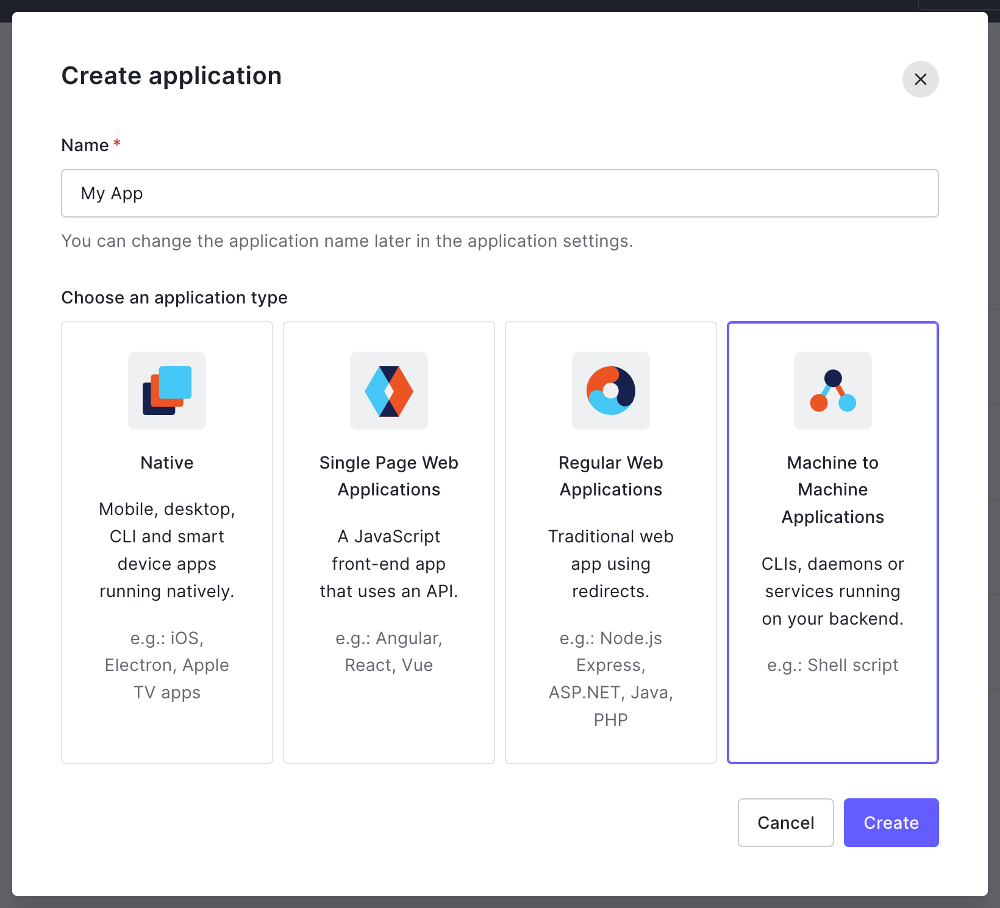
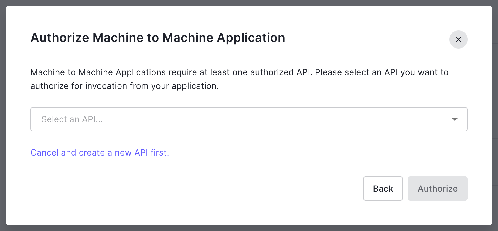
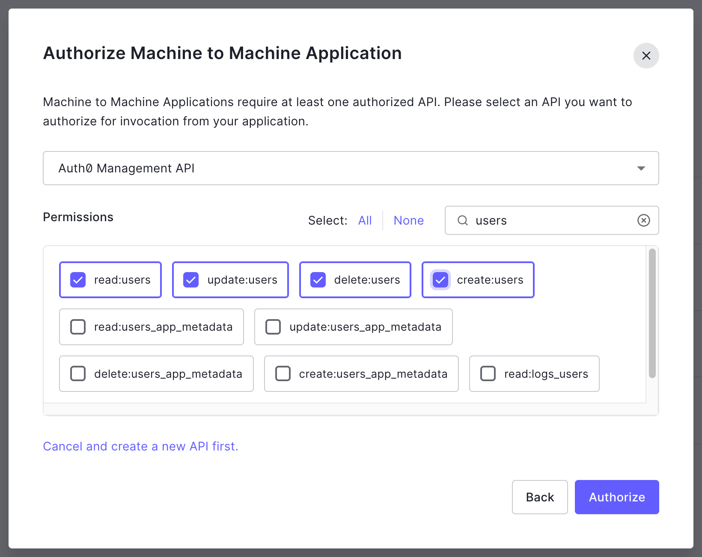

# Auth0 manual and programmatic access tokens

You may use either a [manual or programmatic access token](https://auth0.com/./secure/tokens/access-tokens/management-api-access-tokens)

You can create a _manual token with a lifetime (in seconds)_ but once it has expired you must create another token

A [programmatic token requires more configuration](https://auth0.com/docs/secure/tokens/access-tokens/get-management-api-access-tokens-for-production) but when the token expires _this application_ can request another token, over the network, without interruption

## 1. Create a "Machine to Machine" application in Auth0

Enter a _Name_, click to select _Machine to Machine Applications_ and click _Create_

## 2. Authorise the application for the Management API

Select _Management API_ and click _Authorize_

## 3. Authorise the application with permsissions

Filter by _users_ and click to select each of `read:users` `update:users` `create:users` `delete:users` then click _Authorize_

## 4. Application details

The next page shows the details of your application

On the _Settings_ tab, under _Basic Information_ (at the top of the page) you can confirm the _Name_ and find its _Domain_, _Client ID_, and _Client Secret_

On the _APIs_ tab, you can find its API identifier

You will need some of these values when starting _this application_ with a manual token

You will need all of these values when starting _this application_ with a programmatic token
