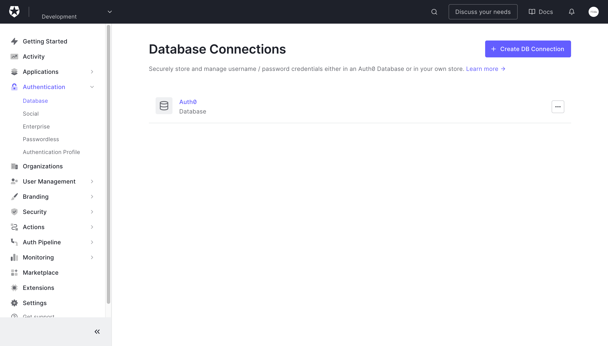
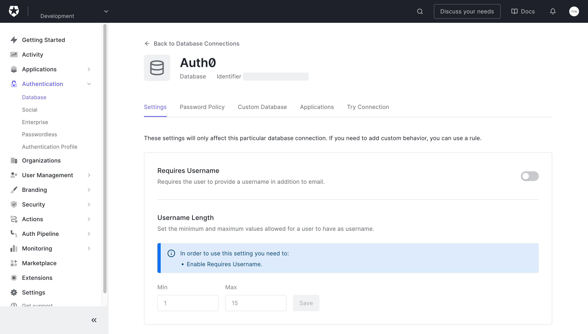
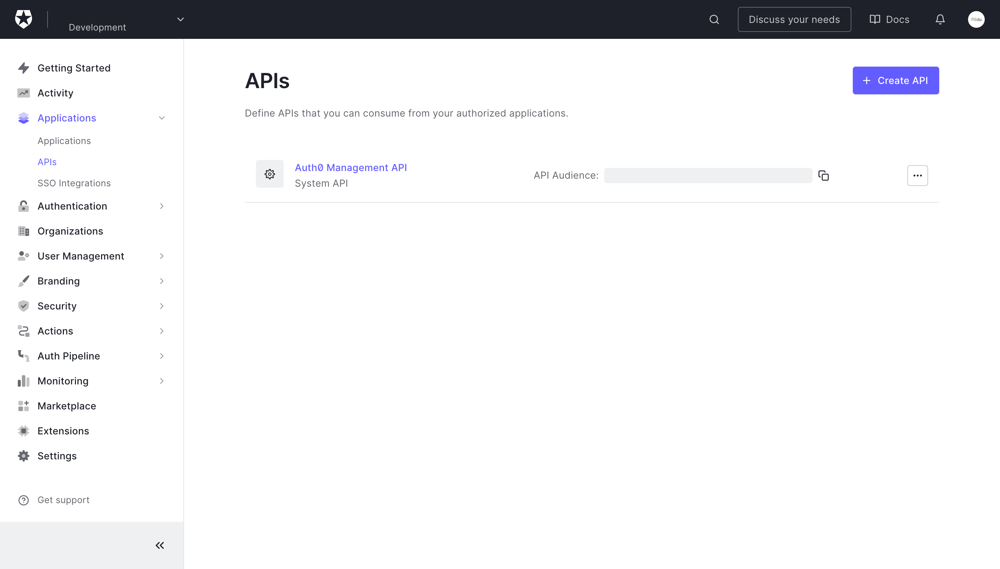

# Creating a programmatic access token

For the _Connection ID_ values log in to the [Auth0 management dashboard](https://manage.auth0.com/). Under _Authentication_, then _Database_, find a link to the _Database Connection_ to which you want to import users



Click through to the _Database Connection_ page



In the header (at the top of the page) you will find the connection _Identifier_ which you can copy to your clipboard (in the image it is redacted)

For the _Audience_ and _URL_ values log in to the [Auth0 management dashboard](https://manage.auth0.com/). Under _Applications_, then _APIs_, find a link to the _Auth0 Management API_



Here you will find the _Audience_ value which you can copy to your clipboard (in the image it is redacted)

Click through to the _Auth0 Management API_ page and on the _Test_ tab (at the top), under _Asking Auth0 for tokens from my application_ you will find some example code for different tools

Under _CURL_ find the _URL_

```bash
--url https://<AUTH0 DOMAIN>.uk.auth0.com/oauth/token \
```

(where `<AUTH0 DOMAIN>` is your _Domain_)

Copy that URL (only the URL, including the `https` part, but not including any of the Bash)

In review

- The _Domain_ is the `AUTH0_DOMAIN`
- The _Connection ID_ is the `AUTH0_CONNECTION_ID`
- The _Client ID_ is the `AUTH0_CLIENT_ID`
- The _Client Secret_ is the `AUTH0_CLIENT_SECRET`
- The _Audience_ is the `AUTH0_AUDIENCE`
- The _URL_ is the `AUTH0_RESOURCE`
