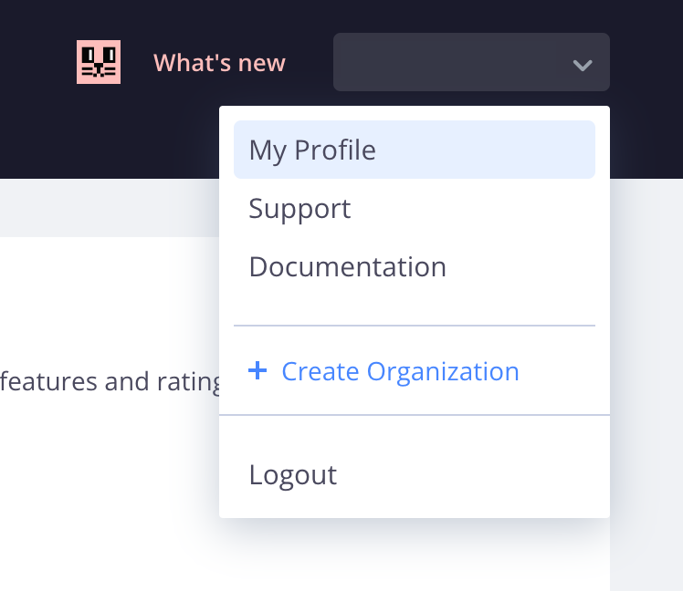
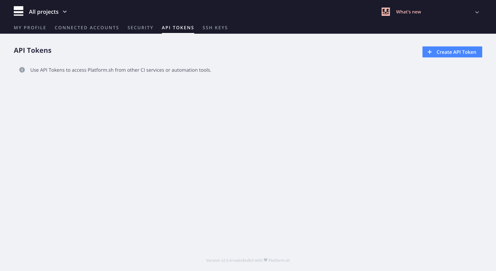
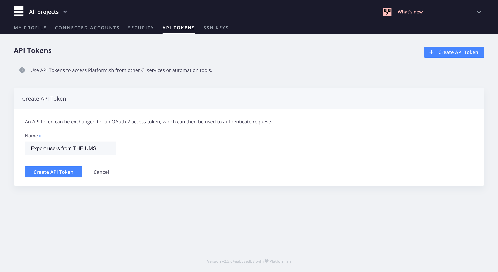
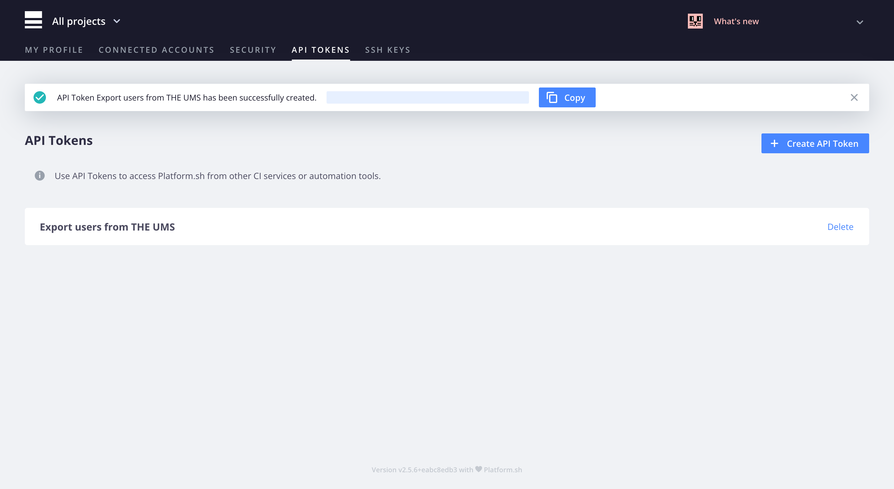

# Creating an API access token

You need

- Access to the User Management System project in [Platform.sh](https://platform.sh)

## Create an API access token

In the [Platform.sh console](https://console.platform.sh) select My Profile from the dropdown menu in the top right-hand corner



Click "API TOKENS" in the page header menu


Click the "Create API Token" CTA on the right-hand side below the page header menu



Enter a descriptive name in the "Name" field. Click the "Create API Token" CTA below it



Click the "Copy" CTA to copy the access token to your device's clipboard



Paste the access token as the value of the `PLATFORMSH_CLI_TOKEN` environment variable in your `.env` file

```dotenv
PLATFORMSH_CLI_TOKEN=<ACCESS TOKEN>
```
