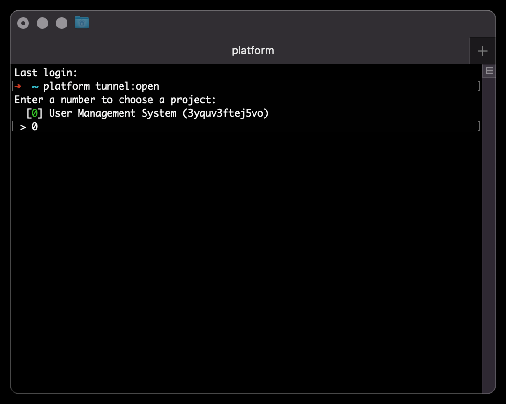

# Logging in to Platform.sh and opening a tunnel

You need

- The [Platform.sh CLI installed on your device](https://docs.platform.sh/administration/cli.html)

## 1 - Login to Platform.sh

In a terminal, login to Platform.sh. This will open a browser window for you to enter your credentials


## 2 - Open an tunnel

Open a tunnel to the User Management System



Enter an environment ID (in this case `master`) then enter `y` to open the tunnel


# 3 - MariaDB connection configuration

Note the connection configuration after `mysql://`


- The _MariaDB User_ is `admin`
- The _MariaDB Password_ is (in this image) _redacted_
- The _MariaDB Host_ is `127.0.0.1`
- The _MariaDB Port_ is `30001`
- The _MariaDB Database_ is `main`

You should each of the values to your device's clipboard

Either paste them as the value to the corresponding key in your `.env` file

```dotenv
MARIADB_USER='<MARIADB USER>'
MARIADB_PASSWORD='<MARIADB PASSWORD>'
MARIADB_HOST='<MARIADB HOST>'
MARIADB_PORT=<MARIADB PORT>
MARIADB_DATABASE='<MARIADB DATABASE>'
```

Or as arguments on the command line

```bash
npm run user -- \
  --MARIADB_USER '<MARIADB USER>' \
  --MARIADB_PASSWORD '<MARIADB PASSWORD>' \
  --MARIADB_HOST '<MARIADB HOST>' \
  --MARIADB_PORT <MARIADB PORT> \
  --MARIADB_DATABASE '<MARIADB DATABASE>'
```
