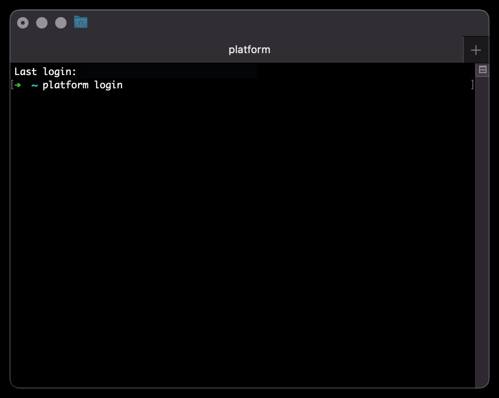

# Logging in to Platform.sh and opening a tunnel

You need

- The [Platform.sh CLI installed on your device](https://docs.platform.sh/administration/cli.html)

## 1 - Login to Platform.sh

In a terminal, login to Platform.sh. This will open a browser window for you to enter your credentials



## 2 - Open an tunnel

Open a tunnel to the User Management System


Enter an environment ID (in this case `master`) then enter `y` to open the tunnel


Note the credentials after `mysql://` - The username is `admin` and the password is (in this image) _redacted_. You should copy the password to your device's clipboard

Either paste it as value to the corresponding key in your `.env` file

```dotenv
MARIADB_PASSWORD=<MARIADB PASSWORD>
```

Or as an argument on the command line

```bash
npm run user -- --MARIADB_PASSWORD '<MARIADB PASSWORD>'
```
