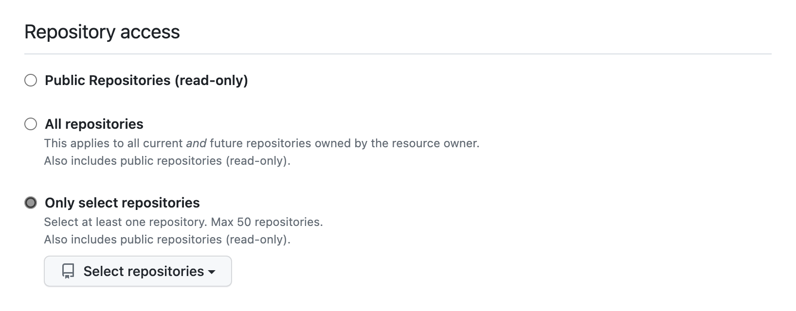
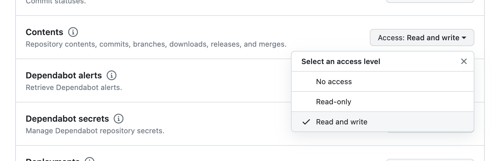

# Pushing validation JSON files into GitHub

You will need

- A GitHub user
- A GitHub personal access token
- A GitHub repository

The application uses _Git LFS_ since the validation JSON files _may be_ too large for Git

**Note** that the validation JSON files are _encrypted_ and must be _decrypted_ after they are pulled from GitHub

Add the environment variables

- `GIT_USER_NAME` which, for me, is "Jonathan Perry"
- `GIT_USER_EMAIL` which, again for me, is "jonathanperry@sequencemedia.net"
- `GIT_USER_ID` is a GitHub user login ID (I am "sequencemedialimited")
- The `GIT_REPOSITORY` value is _part of_ the HTTPS address of the repository for these JSON files
- A `GIT_PERSONAL_ACCESS_TOKEN` which must be created in GitHub for the GitHub user `GIT_USER_ID`

## `GIT_REPOSITORY` environment variable

The value of the `GIT_REPOSITORY` environment variable is an HTTPS address _excluding `https://`_

In other words, if the HTTPS address for the repository is

```
https://github.com/THE-Engineering/validation-json-files.git
```

Then the value the value of `GIT_REPOSITORY` environment variable should be

```
github.com/THE-Engineering/validation-json-files.git
```

(The required URL is assembled in code from `GIT_REPOSITORY` and other environment variables)

## `GIT_PERSONAL_ACCESS_TOKEN` environment variable

The `GIT_PERSONAL_ACCESS_TOKEN` should allow reading and writing to `GIT_REPOSITORY` for the GitHub user `GIT_USER_ID`

1. Create a Fine Grained token with an expiration of 30 days
2. Grant it _Repository Access_ to `GIT_REPOSITORY`

3. Grant it read and write _Permissions_ for _"Contents"_

